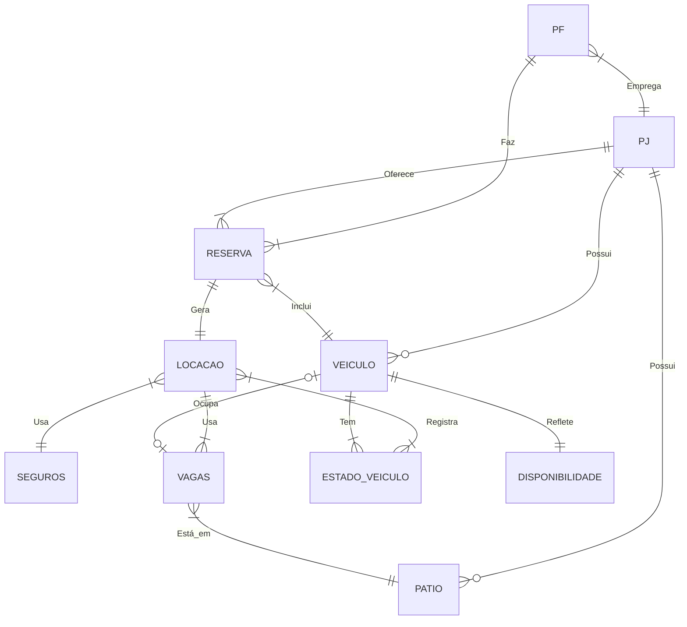
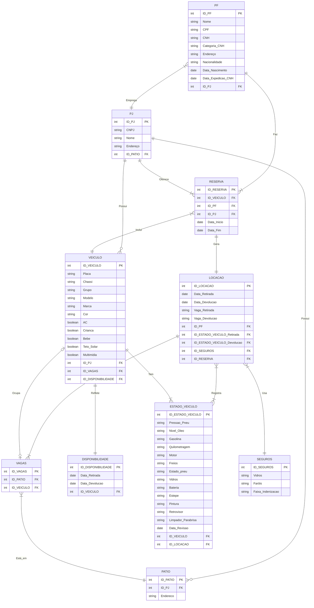

# Conceitual

```mermaid

erDiagram
    PF }|--|| PJ : Emprega
    PF ||--|{ RESERVA : Faz

    PJ ||--|{ RESERVA : Oferece
    PJ ||--o{ PATIO : Possui
    PJ ||--o{ VEICULO : Possui

    RESERVA }|--|| VEICULO : Inclui
    RESERVA ||--|| LOCACAO : Gera

    LOCACAO }|--|| SEGUROS : Usa
    LOCACAO ||--|{ VAGAS : Usa
    LOCACAO }|--|{ ESTADO_VEICULO : Registra

    VEICULO ||--|{ ESTADO_VEICULO : Tem
    VEICULO ||--|| DISPONIBILIDADE : Reflete
    VEICULO o|--|o VAGAS : Ocupa

    VAGAS }|--|| PATIO : Está_em
```

# Lógico

```mermaid


erDiagram
 PF {
        int ID_PF PK
        string Nome
        string CPF
        string CNH
        string Categoria_CNH
        string Endereço
        string Nacionalidade
        date Data_Nascimento
        date Data_Expedicao_CNH
        int ID_PJ FK
    }

    PJ {
        int ID_PJ PK
        string CNPJ
        string Nome
        string Endereço
        int ID_PATIO FK
    }

    VEICULO {
        int ID_VEICULO PK
        string Placa
        string Chassi
        string Grupo
        string Modelo
        string Marca
        string Cor
        boolean AC
        boolean Crianca
        boolean Bebe
        boolean Teto_Solar
        boolean Multimidia
        int ID_PJ FK
        int ID_VAGAS FK
        int ID_DISPONIBILIDADE FK
    }

    VAGAS {
        int ID_VAGAS PK
        int ID_PATIO FK
        int ID_VEICULO FK
    }

    PATIO {
        int ID_PATIO PK
        int ID_PJ FK
        string Endereco
    }

    DISPONIBILIDADE {
        int ID_DISPONIBILIDADE PK
        date Data_Retirada
        date Data_Devolucao
        int ID_VEICULO FK
    }

    ESTADO_VEICULO {
        int ID_ESTADO_VEICULO PK
        string Pressao_Pneu
        string Nivel_Oleo
        string Gasolina
        string Quilometragem
        string Motor
        string Freios
        string Estado_pneu
        string Vidros
        string Bateria
        string Estepe
        string Pintura
        string Retrovisor
        string Limpador_Parabrisa
        date Data_Revisao
        int ID_VEICULO FK
        int ID_LOCACAO FK
    }

    SEGUROS {
        int ID_SEGUROS PK
        string Vidros
        string Faróis
        string Faixa_Indenizacao
    }

    RESERVA {
        int ID_RESERVA PK
        int ID_VEICULO FK
        int ID_PF FK
        int ID_PJ FK
        date Data_Inicio
        date Data_Fim
    }

    LOCACAO {
        int ID_LOCACAO PK
        date Data_Retirada
        date Data_Devolucao
        string Vaga_Retirada
        string Vaga_Devolucao
        int ID_PF FK
        int ID_ESTADO_VEICULO_Retirada FK
        int ID_ESTADO_VEICULO_Devolucao FK
        int ID_SEGUROS FK
        int ID_RESERVA FK
    }
    PF }|--|| PJ : Emprega
    PF ||--|{ RESERVA : Faz

    PJ ||--|{ RESERVA : Oferece
    PJ ||--o{ PATIO : Possui
    PJ ||--o{ VEICULO : Possui

    RESERVA }|--|| VEICULO : Inclui
    RESERVA ||--|| LOCACAO : Gera

    LOCACAO }|--|| SEGUROS : Usa
    LOCACAO ||--|{ VAGAS : Usa
    LOCACAO }|--|{ ESTADO_VEICULO : Registra

    VEICULO ||--|{ ESTADO_VEICULO : Tem
    VEICULO ||--|| DISPONIBILIDADE : Reflete
    VEICULO o|--|o VAGAS : Ocupa

    VAGAS }|--|| PATIO : Está_em

```

